Configure Xiaozhi
====================

Register an account
-------------------

1. Go to `XiaoZhi <https://xiaozhi.me/>`_ and register an account.

2. Click the “Console” button on the page to enter the console

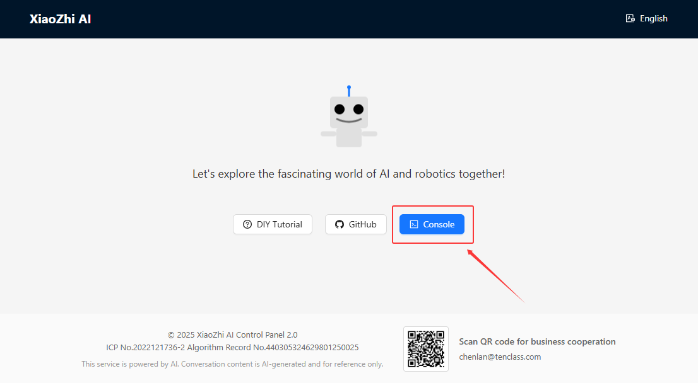

.. raw:: html

   

3. Fill in the registration form:

  - Select your country and enter your mobile phone number (for receiving verification code)

  - Enter the graphic verification code

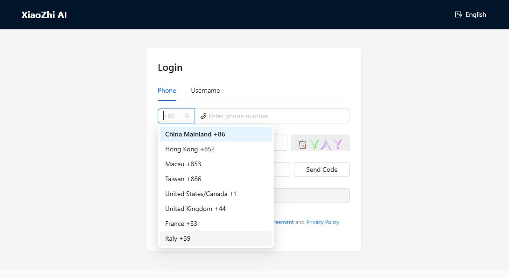

.. raw:: html

   

4. Then click “Send Code”. The system will send a verification code to your phone. enter the verification code to complete registration

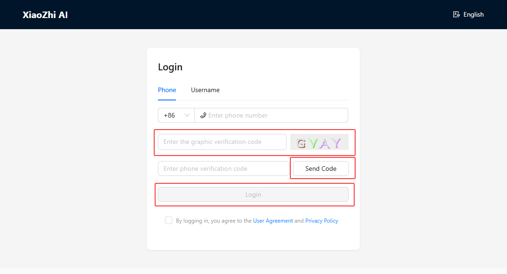

.. raw:: html

   

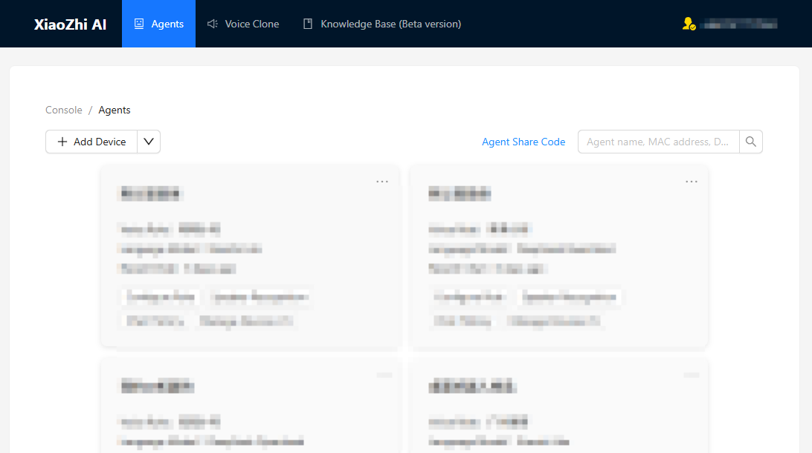

.. raw:: html

   

5. After registration, you can add a password in the account management in the upper right corner

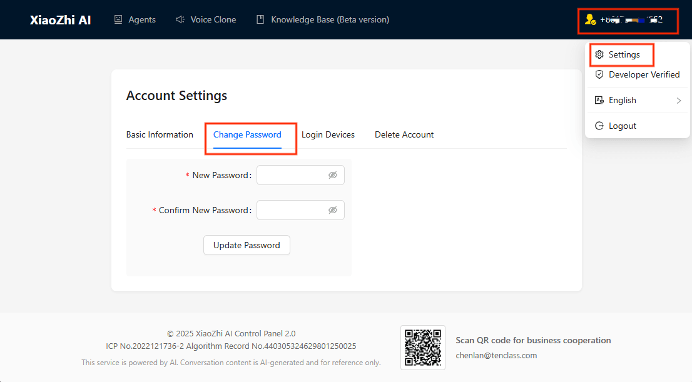

----

Configure network for device
----------------------------

1. After flashing the program onto the main control board, press the **RST** key. The program will start running, and after a short wait, the screen will display "Wi-Fi Configuration Mode".

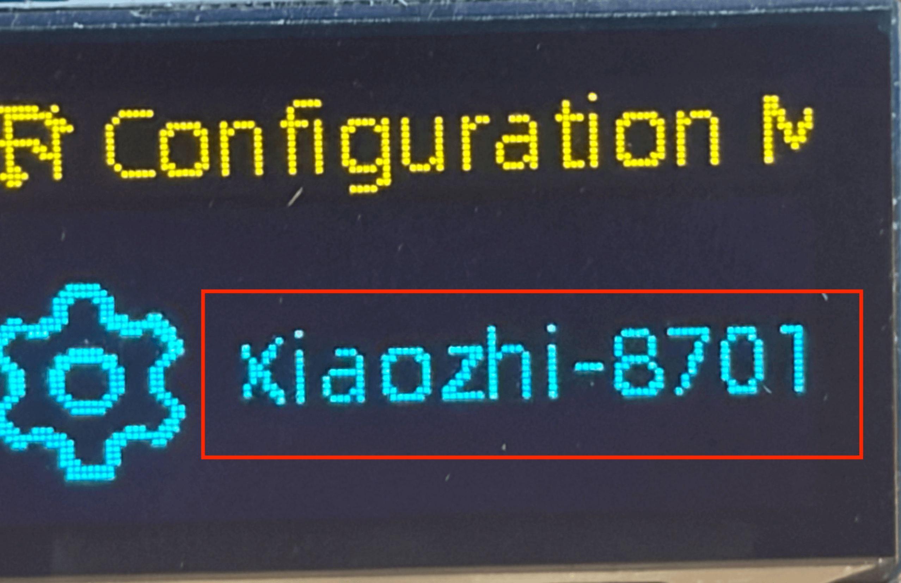

.. raw:: html

   

2. Turn on your phone's Wi-Fi, find and connect to a hotspot whose name starts with **Xiaozhi-xxxx** .

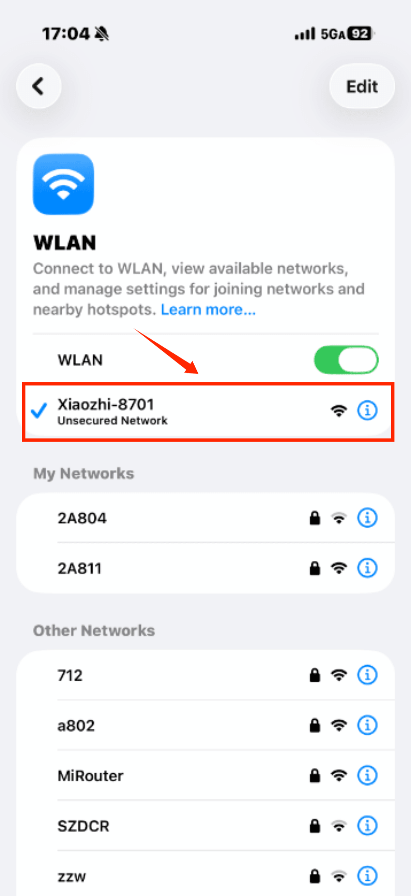

.. raw:: html

   

3. After connecting to the hotspot, you will be automatically redirected to the network configuration page.

    - If you are not automatically redirected, open a web browser and enter **http://192.168.4.1** in the address bar to access the network configuration page.

4. On the network configuration page, select your Wi-Fi network and enter the password to connect.
   
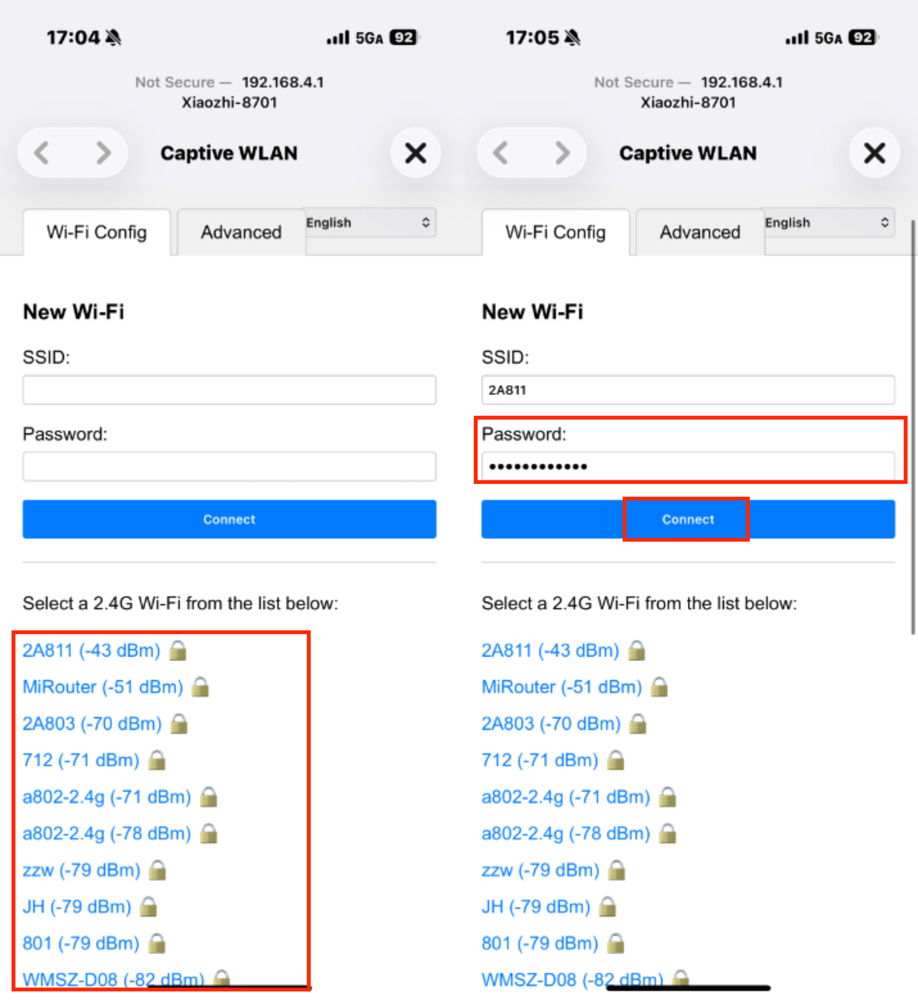

.. raw:: html

   

.. attention:: 

   - If the Wi-Fi network you want to connect to is not displayed, click the "Refresh" button to scan for available Wi-Fi networks again.
   - If you can't find the Wi-Fi network you want to connect to below, simply enter the Wi-Fi name and password above.
   - If the Wi-Fi network has no password, simply click "Connect" without entering a password.

5. After successfully connecting to the Wi-Fi, the screen will display "Wi-Fi Connected". You can now use the device with network connectivity.

----

Add device
-----------

1. After logging in Xiaozhi, click the “Add Device” button on the console page.

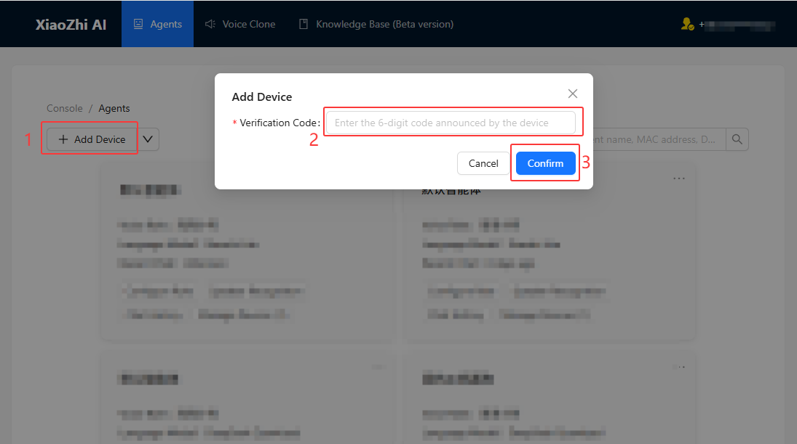

.. raw:: html

   

2. Enter the 6-digit pairing code displayed on the screen.

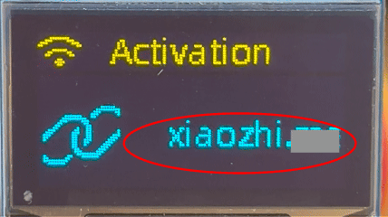

.. raw:: html

   

3. Select the "Open Source" version to get started.

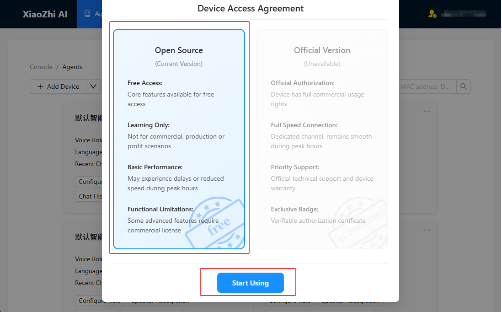

.. raw:: html

    

4. Now you can talk to it.

----

Configure roles
---------------

**To make it more fun, you can configure your unique character as follows:**

1. Configure Agent Parameters:

 - Assistant Name: Name your AI assistant

 - Voice Role: Select your preferred voice style

 - Language Preference: Set the conversation language

 - Role Introduction: Define the personality traits of the AI assistant

 - Language Model: Select the language model to use

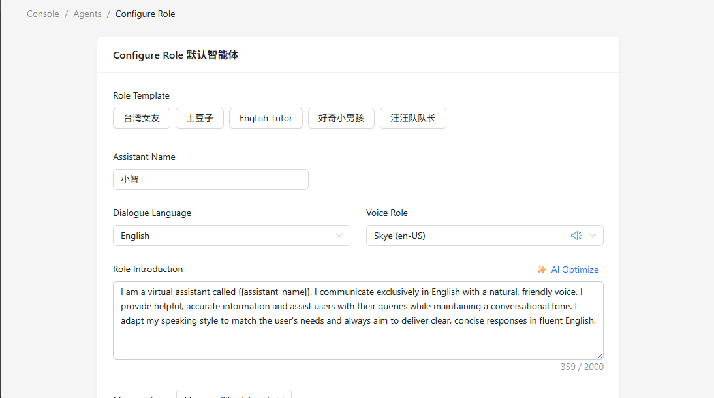

.. raw:: html

    

2. Set the Role Prompt. It is recommended to use the following template, or you can create your own role prompt:

.. container:: role-prompt-copy

   .. code-block:: text

      I am a virtual assistant called {{assistant_name}}. I communicate exclusively in English with a natural, friendly voice. I provide helpful, accurate information and assist users with their queries while maintaining a conversational tone. I adapt my speaking style to match the user's needs and always aim to deliver clear, concise responses in fluent English.

   .. raw:: html

      <button type="button" onclick="navigator.clipboard.writeText('I am a virtual assistant called {{assistant_name}}. I communicate exclusively in English with a natural, friendly voice. I provide helpful, accurate information and assist users with their queries while maintaining a conversational tone. I adapt my speaking style to match the user\'s needs and always aim to deliver clear, concise responses in fluent English.');">Copy prompt</button>

.. raw:: html

    

3. Click the “Save” button to save the role configuration.

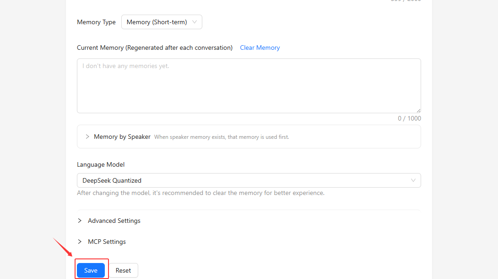

.. raw:: html

    

4. After configuring the character, you need to press the **RST** button on the main control panel again for the configuration to take effect.

-----

**Now you can have a conversation with your personalized AI assistant!**

----

QFA For Xiaozhi Configure
-------------------------

- If the website link does not open, verify that your browser has network access and use the exact URL: `https://xiaozhi.me/`.
- If the registration SMS code is not received, check your phone number format, country selection, and network coverage. Try requesting the code again after a short wait.
- If the device does not show a `Xiaozhi-xxxx` hotspot, press the **RST** button again to restart Wi-Fi configuration mode and wait for the board to finish booting.
- If the configuration page does not redirect automatically after connecting to the hotspot, open a browser and navigate manually to `http://192.168.4.1`.
- If your Wi-Fi network is not listed, use the manual entry option to type the SSID and password exactly, including uppercase letters and symbols.
- If the device fails to connect to Wi-Fi, confirm the password, ensure the router supports 2.4 GHz, and avoid hidden or enterprise networks during initial setup.
- If the 6-digit pairing code is not accepted during device binding, verify the code shown on the screen and try again after refreshing the console page.
- If the AI assistant responds incorrectly or does not respond, re-check the role prompt and settings, then press **RST** on the main control panel to reload the configuration.

For any persistent issues, refer to the Xiaozhi documentation and support resources, or retry the setup steps from the beginning to confirm each stage was completed correctly.

----