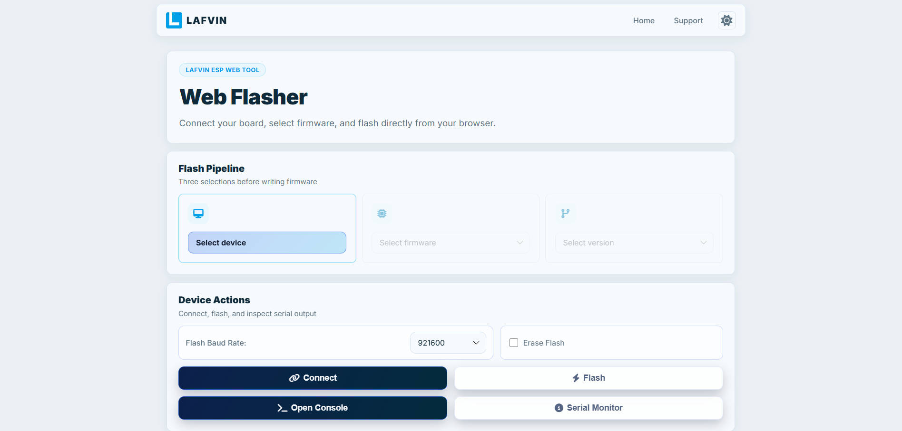
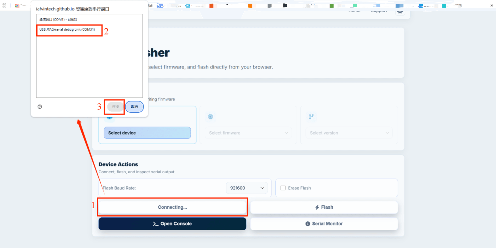
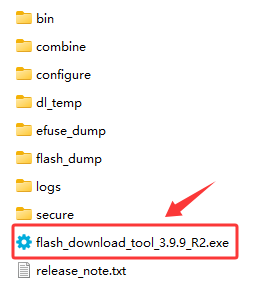
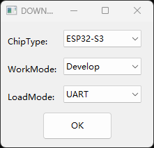

Flash The Firmware
==================

**This product was not pre-programmed at the time of shipment. To use it, you will need to flash the program yourself. Please follow the instructions below to complete the flashing process.**

**This chapter aims to introduce the firmware flashing process. To enable you to quickly experience the product's features, two flashing methods are provided; please select the option that best suits your needs.**

Method 1: Online Flashing
-------------------------

This method allows you to flash the program directly through the online platform without needing to install any additional software on your computer. It is a convenient option for users who prefer a straightforward flashing process.

Step 1: Connect the Device
~~~~~~~~~~~~~~~~~~~~~~~~~~

Use the provided Type-C data cable to connect the **Desktop AI Gimbal Robot Main Control Board** to your computer.

.. image:: _static/flash/1.connect.png
   :width: 800
   :align: center

----

Step 2: Access the Online Flashing Platform
~~~~~~~~~~~~~~~~~~~~~~~~~~~~~~~~~~~~~~~~~~

Click here to jump directly to the online flashing page: `LAFVIN Web Flasher <https://lafvintech.github.io/Lafvin_Web_Flasher/>`_

----

Step 3: Connect Serial Port
~~~~~~~~~~~~~~~~~~~~~~~~~~~

Click "Connect," and in the pop-up serial port selection window, select the appropriate serial port to establish the connection.

.. raw:: html

   

.. attention::

    If you are unsure which serial port to select, you can disconnect the device and check which port disappears from the list, then reconnect it and select that port.

    If no new serial port is detected, it indicates that the main control board has not entered download mode. Please proceed as follows: press and hold the **BOOT button**, then connect the data cable to the main control board.

----

Step 4: Select the Firmware
~~~~~~~~~~~~~~~~~~~~~~~~~~~

Select the corresponding firmware as shown in the images below.

.. image:: _static/flash/2.select.png
   :width: 800
   :align: center   

----

Step 5: Start Flashing
~~~~~~~~~~~~~~~~~~~~~~
Click the "Flash" button to start the flashing process. The progress will be displayed on the screen, and once completed, you can disconnect the device and start using it.

.. image:: _static/flash/3.flash.png
   :width: 800
   :align: center

----

Method 2: Flash Download Tool
-----------------------------
This method requires you to install a flash download tool on your computer. It is suitable for users who prefer a more hands-on approach to flashing the firmware.

Step 1: Download and Install the Flash Download Tool
~~~~~~~~~~~~~~~~~~~~~~~~~~~~~~~~~~~~~~~~~~~~~~~~

Download Flash Download Tool from the resource package we provide. After decompression, open the file, select “flash_download_tool_xxx.exe” and double-click to open the software.

----

Step 2: Configure Flash Download Tool
~~~~~~~~~~~~~~~~~~~~~~~~~~~~~~~~~~~~

In the Flash Download Tool, select the appropriate settings as shown in the image below.

 .. raw:: html

   

Import the firmware following the steps shown in the image.

.. image:: _static/flash/5.tool.png
   :width: 800
   :align: center

.. attention::

    Please download the firmware file provided in the resource package in advance.

----

Step 3: Start Flashing
~~~~~~~~~~~~~~~~~~~~~~

Click the "Start" button to begin the flashing process. The progress will be displayed in the software, and once completed, you can disconnect the device and start using it.

.. image:: _static/flash/6.tool.png
   :width: 800
   :align: center   

----

Troubleshooting Flashing Issues
--------------------------------

If you encounter issues with flashing or the flashing process fails, please perform the following self-check steps:

- **Check USB Connection**: Ensure the Type-C data cable is securely connected to both the Desktop AI Gimbal Robot Main Control Board and your computer. Try using a different USB port or cable if possible.

- **Verify Power Supply:** Ensure that the device is properly powered on. Please insert an 18650 battery; the main control board must maintain a stable power supply throughout the flashing process.

- **Check Device Drivers**: Ensure that the necessary USB drivers are installed on your computer. For Windows, check Device Manager for any unrecognized devices. For macOS/Linux, verify serial port permissions.

- **Select Correct COM Port**: In the Flash Download Tool or online flasher, confirm that the correct COM port (serial port) is selected. You can find this in your computer's Device Manager (Windows) or System Report (macOS).

- **Restart Software and Device**: Close the flashing software, disconnect and reconnect the device, then restart the flashing process.

- **Disable Antivirus/Firewall**: Temporarily disable any antivirus software or firewall that might be interfering with the flashing process.

- **Try Different Browser/Computer**: If using the online flasher, try a different web browser or computer to rule out compatibility issues.

- **Check Firmware File**: Ensure you are using the correct firmware file from the provided resource package and that it is not corrupted.

If the issue persists after performing these checks, please contact our technical support team with details about your setup, error messages, and the steps you've already tried.

----

