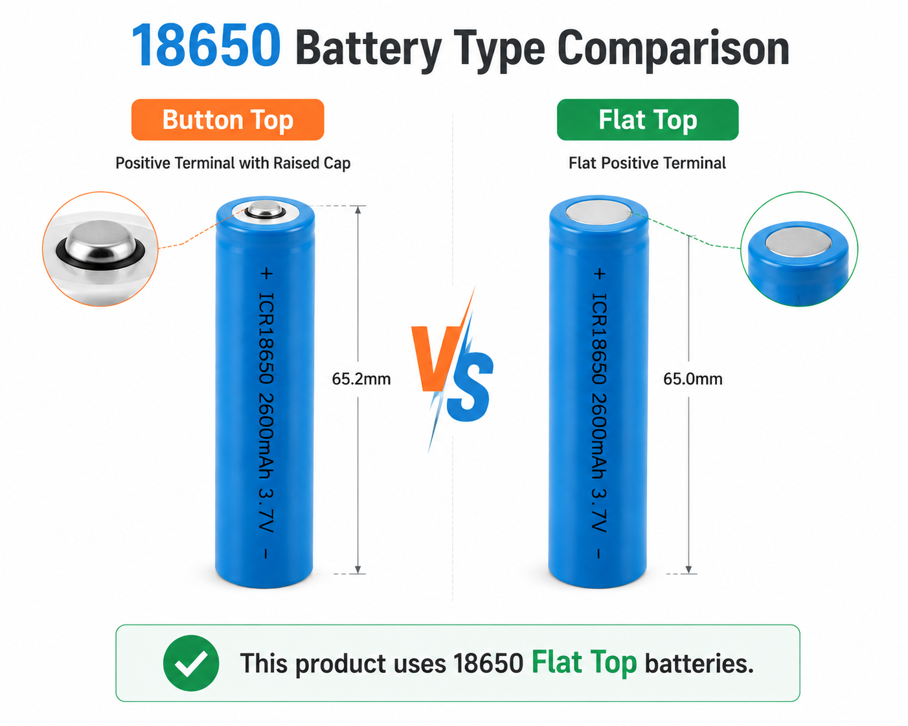
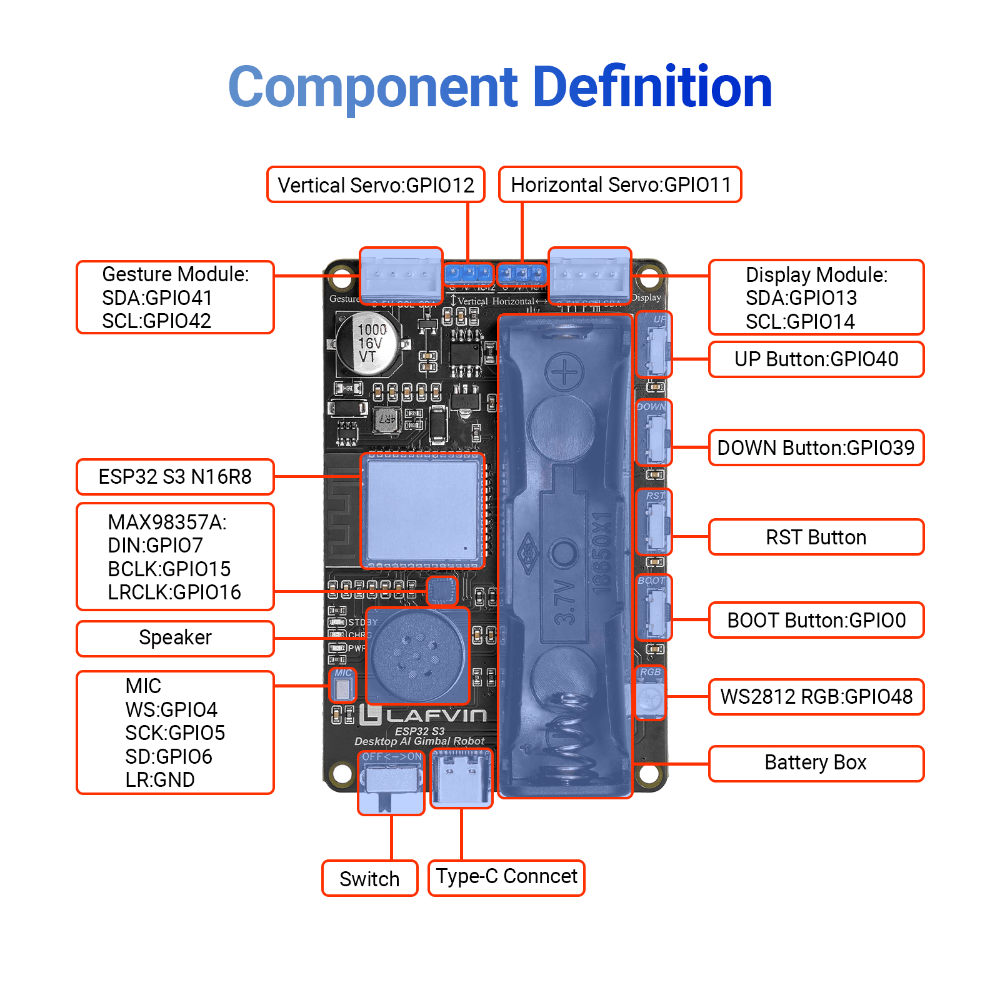

Introduction
============

**Dear friends, welcome to the learning world of the LAFVIN Desktop AI Gimbal Robot!**

**Please read this documentation carefully. If you encounter any problems during use, please contact our after-sales support team, and we will assist you as soon as possible.**

----

**LAFVIN Desktop AI Gimbal Robot**

.. image:: _static/2.gimbal.png
   :width: 800
   :align: center

----

Bill of Materials
-----------------

.. image:: _static/3.bom11.png
   :width: 800
   :align: center

.. raw:: html

   

.. list-table:: 
   :header-rows: 1
   :widths: 10 40 20
   :align: center

   * - Serial Number
     - Name
     - Quantity
   * - 1
     - Desktop AI Gimbal Robot Main Control Board
     - x1
   * - 2
     - MG90S Servo 
     - x2
   * - 3
     - Gesture Recognition Module
     - x1
   * - 4
     - 0.96 Inch OLED Display
     - x1
   * - 5
     - Custom Acrylic Panels
     - x2
   * - 6
     - Custom Gimbal Sheet Metal Parts
     - x4
   * - 7
     - 4-Pin Connection Cable
     - x3
   * - 8
     - Type-C Data Cable
     - x1
   * - 9
     - Phillips screwdriver
     - x1  
   * - 10
     - Screw Pack
     - x5  
   * - 11
     - Cable ties
     - x4 

----

.. attention::

   Please check the contents of the package against the bill of materials. If you find any missing or damaged items, please contact our technical support team immediately.

   The package does **not include an 18650 battery**. The Type-C data cable is only for flashing firmware and charging. Please note that powering the entire system solely through the Type-C data cable is insufficient and may cause the robot to crash or restart.

- **18650 batteries come in flat-top and button-top varieties,please purchase the flat-top version.**

.. raw:: html

   

----

Technical Parameters
--------------------

- **The figure below shows the component definitions for the main control board:**

.. raw:: html

   

.. list-table:: 
   :header-rows: 1
   :widths: 20 30
   :align: center

   * - Parameter
     - Value
   * - Input Voltage
     - One 18650 battery（3.7–4.2V）
   * - Operating Voltage
     - 3.3V-5V
   * - Charging Voltage
     - TYPE-C 5V/2A
   * - Main Control Chip
     - ESP32-S3 N16R8
   * - Power Amplifier Chip
     - MAX98357AETE+T
   * - Microphone Model
     - Digital I2S output
   * - Servo Model
     - MG90S Servo
   * - Screen Model
     - SSD1306 0.96 Inch OLED Display
   * - Gesture Module Signal
     - PAJ7620U2
   * - Speaker
     - 8Ω 1W

----

Function Introduction
---------------------

A desktop robot based on the ESP32-S3, featuring an integrated 2-DOF gimbal, gesture recognition, and intelligent voice interaction.

Supporting voice interaction, facial expression display, and gesture control, it serves as an excellent hardware platform for exploring Edge AI.

More than just a desktop electronic pet, it is a programmable AI terminal—ideal for geeks, educators, and AI enthusiasts.
Resource Download

**Powerful Development Board**

- The main control board features a high-performance ESP32-S3 main control chip, equipped with 16MB Flash and 8MB PSRAM, and a high-performance, low-power Wi-Fi + Bluetooth dual-mode MCU module.

- Employs an Xtensa® 32-bit LX7 dual-core processor, easily handling the needs of graphical interface display, multitasking, wireless communication, and AIoT application development.

**Intelligent Interaction Methods**

- Voice Interaction: Features a built-in "Xiaozhi" AI assistant (based on xiaozhi-esp32), supporting custom wake-up words for real-time voice Q&A and control.

- Gesture Recognition: Supports gestures such as waving and rotating, enabling contactless interaction.

- Dynamic Expressions: A 0.96-inch OLED display showcases a variety of expressions and status icons, bringing the robot to life.

**Flexible Athletic Ability**

- 2-DOF Gimbal: Equipped with two MG90S servos, it can perform smooth pan and tilt movements, allowing it to "look around" and "nod" in response to interactions.

----

**Next, we will delve into the core content of the course and help you gradually understand the relevant concepts and master the operation procedures.**

----
