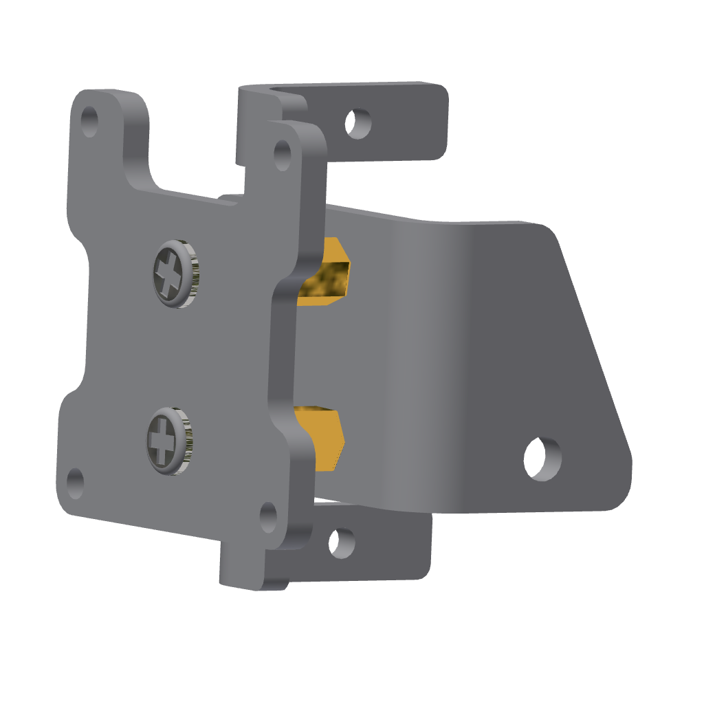

Assembly Tutorial
=================

**This chapter will explain the assembly process of the AI ​​gimbal robot and provide video and text tutorials, which you can choose to view according to your needs.**

.. attention::

      Before starting the assembly, please make sure to read the instructions carefully and follow the steps in order. If you encounter any issues during the assembly process, feel free to reach out to our support team for assistance. We are here to help you every step of the way!    
            
      Before assembly, please make sure to flash the program onto the main control board to ensure that subsequent servo calibration can proceed normally. If you have not yet completed the flashing process, please refer to the `Flashing Program <FlashingProgram.html>`_ chapter for detailed instructions on how to flash the firmware onto the main control board.

Video Tutorial
----------------

The video tutorial is available on our official YouTube channel. You can watch the assembly process step by step and follow along with the instructions.

Illustrated tutorial
---------------------

The illustrated tutorial provides a step-by-step guide with images to help you through the assembly process. Each step is accompanied by detailed instructions and visuals to ensure that you can easily follow along.
   
STEP 1: Assemble the Base
~~~~~~~~~~~~~~~~~~~~~~~~~~~

**Required components:**

- Main control board
- Acrylic base plate
- M3x10mm screws (4 PCS)
- M3x23mm brass pillars (4 PCS)
- M3 washers (4 PCS)
- 18650 battery (not included)

**Assembly Steps:**

1. Place the main control board on the acrylic base plate, aligning it with the holes.

2. Pass the M3x10mm screws through the holes in the acrylic base plate and place the M3 washers in the screws.

3. Align the four positioning holes on the main control board and place it in the screws, then place the M3x23mm copper posts and tighten.

4. Install a fully charged 1860 battery into the battery compartment on the main control board, paying attention to the positive and negative terminals. Batteries are not included in the package; please provide your own.

.. image:: _static/assembly/1.base.png
   :width: 800
   :align: center

----

STEP 2: Assemble the gimbal base
~~~~~~~~~~~~~~~~~~~~~~~~~~~~~~

**Required components:**

- Acrylic top cover
- Metal gimbal base plate
- Servo motor slotted arm
- M3x10mm screws (4 PCS)
- M3 nuts (4 PCS)
- M1.5x5mm self-tapping screws (2 PCS)
- M3 washers (4 PCS)

**Assembly Steps:**

1. Align the servo arm with the holes on the metal gimbal base and secure it using M1.5x5 self-tapping screws.

2. Place the assembled servo arm metal universal joint base onto the acrylic top cover, aligning it with the holes.

3. Pass an M3x10mm screw through the hole on the acrylic top cover and install an M3 washer on the screw.

4. Align the hole on the metal universal joint base with the screw, then install the M3 nut and tighten it.

.. image:: _static/assembly/2.gimbal.png
   :width: 800
   :align: center

----

STEP 3: Assemble the gesture module
~~~~~~~~~~~~~~~~~~~~~~~~~~~~~~

**Required components:**

- Gesture recognition module
- Metal horizontal servo bracket
- M3x8mm screws (1 PCS)

**Assembly Steps:**

1. Align the holes on the gesture recognition module with the holes on the metal horizontal servo bracket.        
2. Pass an M3x8mm screw through the holes and tighten it to secure the gesture recognition module to the metal horizontal servo bracket.

.. image:: _static/assembly/3.gesture.png
   :width: 800
   :align: center

----

STEP 4: Assemble horizontal servo
~~~~~~~~~~~~~~~~~~~~~~~~~~~~~~~~~

**Required components:**

- Metal horizontal servo bracket with gesture module assembled
- MG90S servo
- M2x8mm screw (2 PCS)
- M2 nut (2 PCS)

**Assembly Steps:**

1. Align the holes on the MG90S servo with the holes on the metal horizontal servo bracket.
2. Pass an M2x8mm screw through the holes and install an M2 nut on the screw, then tighten it to secure the MG90S servo to the metal horizontal servo bracket.
3. Note the installation direction of the servo: the end of the servo with the wiring harness should be installed facing backwards.
.. image:: _static/assembly/4.horizontal.png
   :width: 800
   :align: center

----

STEP 5: Assemble screen support columns
~~~~~~~~~~~~~~~~~~~~~~~~~~~~~~

**Required components:**

- Metal horizontal servo bracket
- Metal screen bracket
- M3x8mm screws (4 PCS)
- M3x10mm copper pillars (4 PCS)

**Assembly Steps:**

1. Align the holes on the metal screen bracket with the holes on the metal horizontal servo bracket.
2. Pass an M3x8mm screw through the holes and install an M3x10mm copper pillar on the screw, then tighten it to secure the metal screen bracket to the metal horizontal servo bracket.          

----

STEP 6: Assemble vertical servo
~~~~~~~~~~~~~~~~~~~~~~~~~~~~~~~~~

**Required components:**

- Metal horizontal servo bracket assembled with screen support
- MG90S servo
- M2x8mm screw (2 PCS)
- M2 nut (2 PCS)

**Assembly Steps:**

1. Align the holes on the MG90S servo with the holes on the metal horizontal servo bracket assembled with screen support.
2. Pass an M2x8mm screw through the holes and install an M2 nut on the screw, then tighten it to secure the MG90S servo to the metal horizontal servo bracket assembled with screen support.  
3. Note the installation direction of the servo: the end of the servo with the wiring harness should be installed facing backwards.

.. image:: _static/assembly/6.vertical.png
   :width: 800
   :align: center

----

STEP 7: Connect the servo wires

