2.Assembly Tutorial
====================

**This chapter will explain the assembly process of the AI ​​gimbal robot and provide video and text tutorials, which you can choose to view according to your needs.**

.. attention::

      Before starting the assembly, please make sure to read the instructions carefully and follow the steps in order. If you encounter any issues during the assembly process, feel free to reach out to our support team for assistance. We are here to help you every step of the way!    
            
      Before assembly, please make sure to flash the program onto the main control board to ensure that subsequent servo calibration can proceed normally. If you have not yet completed the flashing process, please refer to the `Flashing Program <FlashingProgram.html>`_ chapter for detailed instructions on how to flash the firmware onto the main control board.

**Video Tutorial**

- The video tutorial is available on our official YouTube channel. You can watch the assembly process step by step and follow along with the instructions.

**Illustrated Tutorial**

- The illustrated tutorial provides a step-by-step guide with images to help you through the assembly process. Each step is accompanied by detailed instructions and visuals to ensure that you can easily follow along.
   
STEP 1: Assemble the Base
--------------------------

**Required components:**

- Main control board
- Acrylic base plate
- M3x12mm screws (4 PCS)
- M3x23mm brass pillars (4 PCS)
- M3 washers (4 PCS)
- 18650 battery (not included)

**Assembly Steps:**

1. Place the main control board on the acrylic base plate, aligning it with the holes.

2. Pass the M3x12mm screws through the holes in the acrylic base plate and place the M3 washers in the screws.

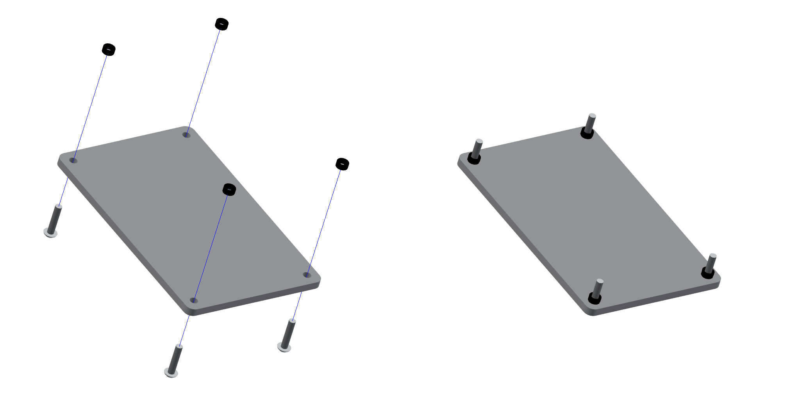

.. raw:: html

   

3. Align the four positioning holes on the main control board and place it in the screws, then place the M3x23mm copper posts and tighten.

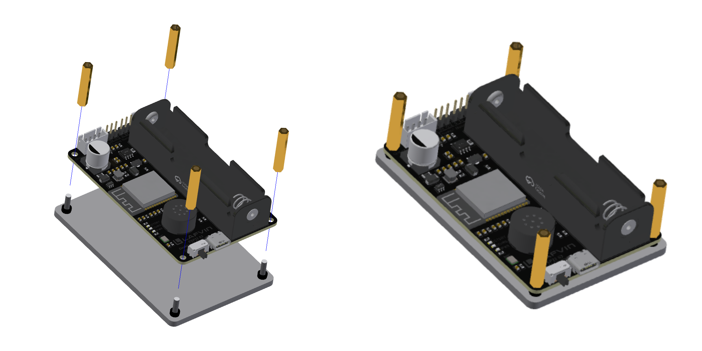

.. raw:: html

   

4. Install a fully charged 18650 battery into the battery compartment on the main control board, paying attention to the positive and negative terminals. Batteries are not included in the package; please provide your own.

----

STEP 2: Assemble The Gimbal Base
--------------------------------

**Required components:**

- Acrylic top cover
- Metal gimbal base plate
- Servo arm (straight arm)
- M3x12mm screws (4 PCS)
- M3 nuts (4 PCS)
- M1.5x5mm self-tapping screws (2 PCS)
- M3 washers (4 PCS)

**Assembly Steps:**

1. Align the servo arm with the holes on the metal gimbal base and secure it using M1.5x5 self-tapping screws.

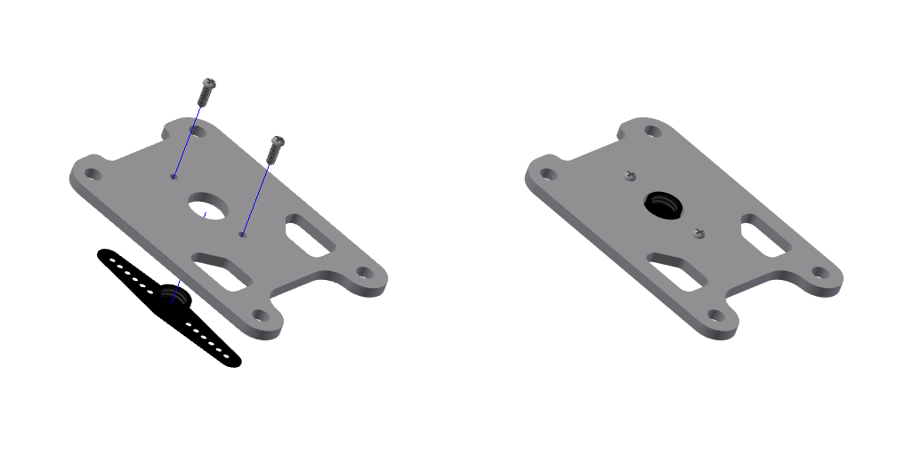

.. raw:: html

   

2. Place the assembled servo arm metal universal joint base onto the acrylic top cover, aligning it with the holes.

3. Pass an M3x12mm screw through the hole on the acrylic top cover and install an M3 washer on the screw.

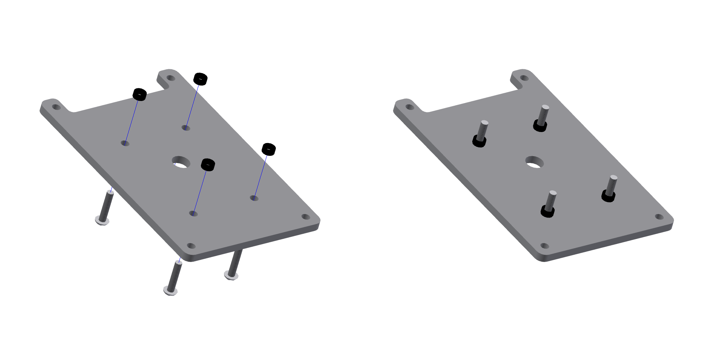

.. raw:: html

   

4. Align the hole on the metal universal joint base with the screw, then install the M3 nut and tighten it.

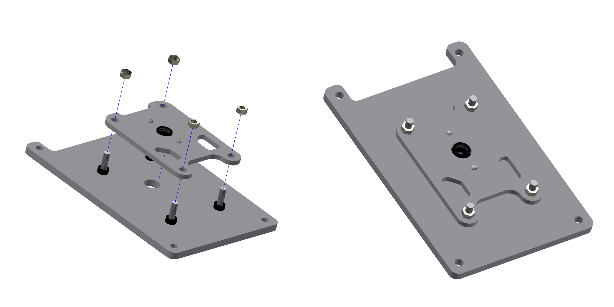

.. raw:: html

   

----

STEP 3: Assemble The Gesture Module
------------------------------------

**Required components:**

- Gesture recognition module
- Metal horizontal servo bracket
- M3x6mm screws (1 PCS)

**Assembly Steps:**

1. Align the holes on the gesture recognition module with the holes on the metal horizontal servo bracket.        
2. Pass an M3x6mm screw through the holes and tighten it to secure the gesture recognition module to the metal horizontal servo bracket.

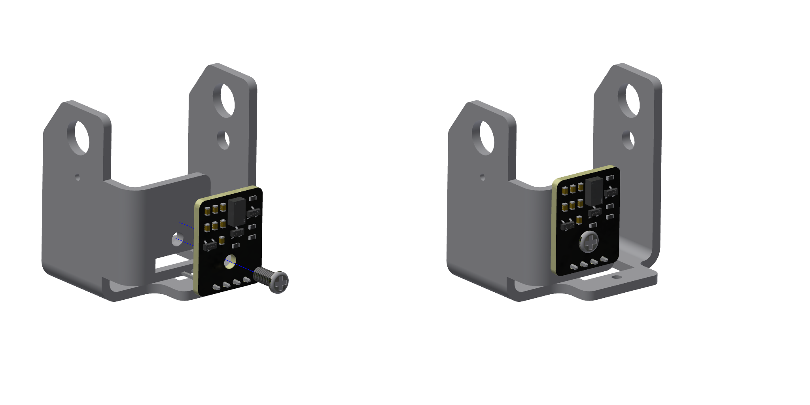

.. raw:: html

   

.. attention::

 The holes in the sheet metal are threaded, so the component can be secured simply by tightening the screws; no nuts are required.

----

STEP 4: Assemble Horizontal Servo
---------------------------------

**Required components:**

- Metal horizontal servo bracket with gesture module assembled
- MG90S servo
- M2x12mm screw (2 PCS)
- M2 nut (2 PCS)

**Assembly Steps:**

1. Align the holes on the MG90S servo with the holes on the metal horizontal servo bracket.
2. Pass an M2x12mm screw through the holes and install an M2 nut on the screw, then tighten it to secure the MG90S servo to the metal horizontal servo bracket.
3. Note the installation direction of the servo: the end of the servo with the wiring harness should be installed facing backwards.

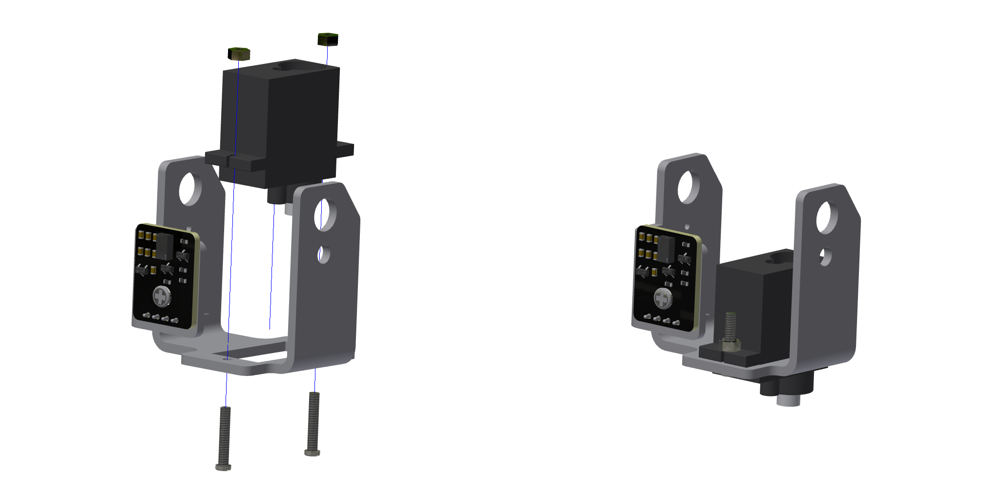

.. raw:: html

   

----

STEP 5: Assemble Screen Support Columns
---------------------------------------

**Required components:**

- Metal horizontal servo bracket
- Metal screen bracket
- M3x6mm screws (4 PCS)
- M3x10mm copper pillars (4 PCS)

**Assembly Steps:**

1. Align the holes on the metal screen bracket with the holes on the metal horizontal servo bracket.

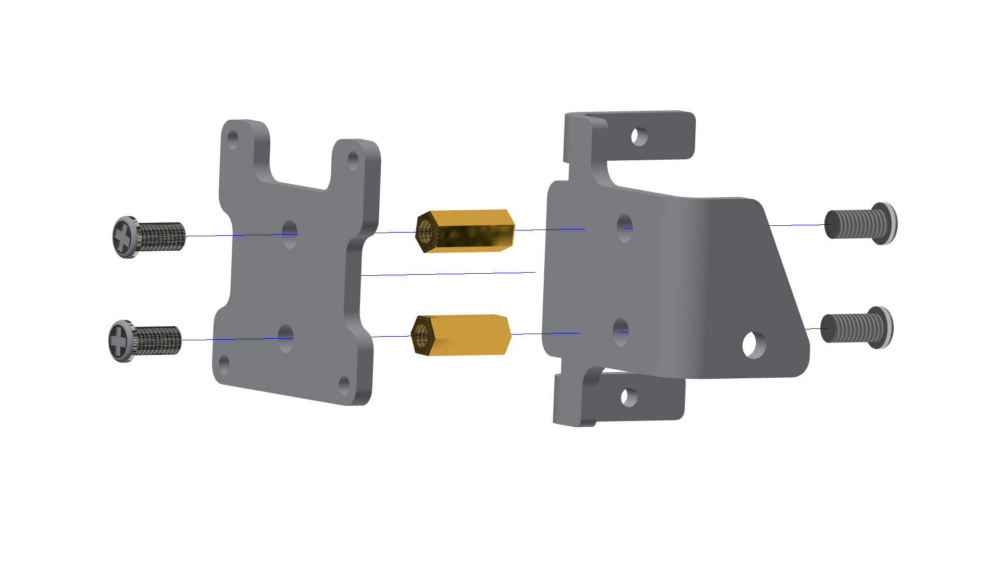

.. raw:: html

   

2. Pass an M3x6mm screw through the holes and install an M3x10mm copper pillar on the screw, then tighten it to secure the metal screen bracket to the metal horizontal servo bracket.          

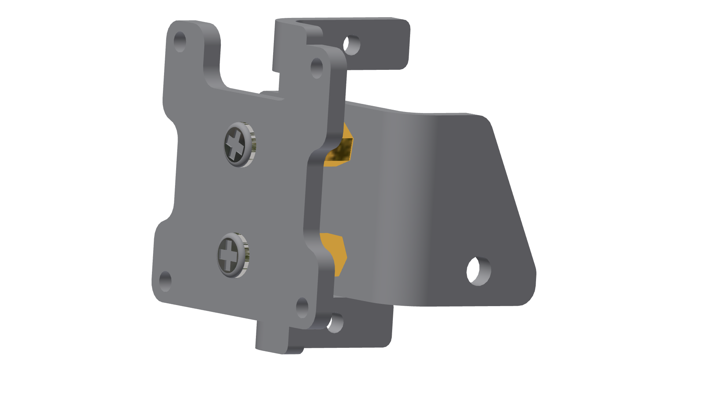

.. raw:: html

   

----

STEP 6: Assemble Vertical Servo
-------------------------------

**Required components:**

- Metal horizontal servo bracket assembled with screen support
- MG90S servo
- M2x12mm screw (2 PCS)
- M2 nut (2 PCS)

**Assembly Steps:**

1. Align the holes on the MG90S servo with the holes on the metal horizontal servo bracket assembled with screen support.
2. Pass an M2x12mm screw through the holes and install an M2 nut on the screw, then tighten it to secure the MG90S servo to the metal horizontal servo bracket assembled with screen support.  

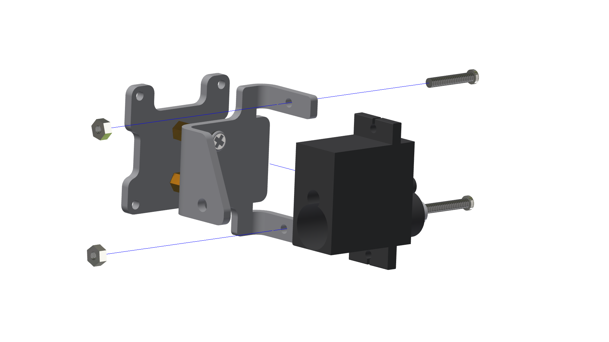

.. raw:: html

   

3. Note the installation direction of the servo: the end of the servo with the wiring harness should be installed facing backwards.

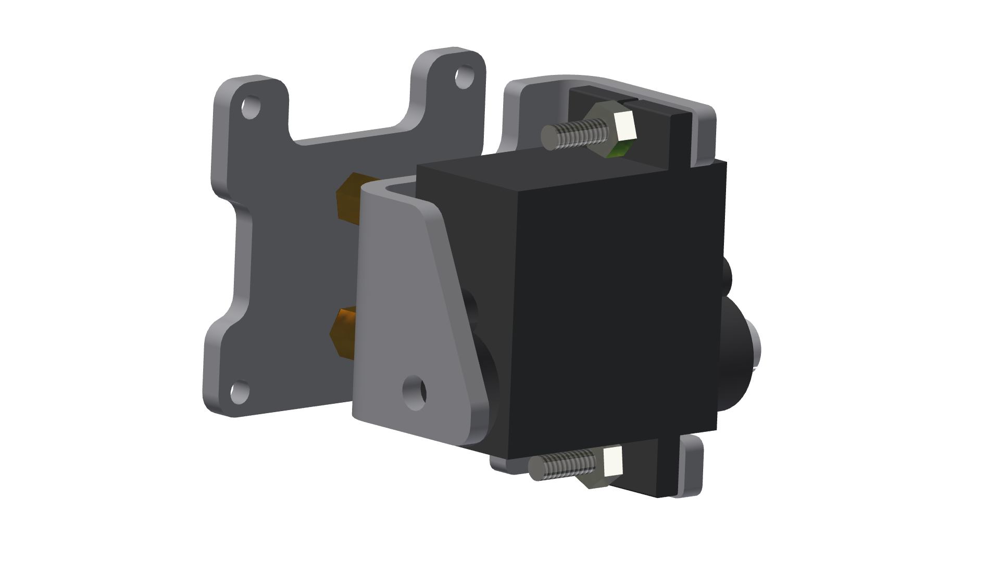

.. raw:: html

   

----

STEP 7: Combine The Two Servos
------------------------------

.. attention::

  Preliminary Steps: Servo Reset and Firmware Confirmation:

  Before proceeding with this step, a servo reset must be performed to ensure the servos are in their initial mechanical zero position.

  Confirm Firmware Status: The servo reset function relies on the program control on the main control board. Please confirm that the main control board has been firmware flashed; if not, please refer to and complete the steps in the [Firmware Flashing Tutorial] beforehand. 

  Connect Servo Signal Cables: Connect the signal cables of the vertical and horizontal servos to the corresponding interfaces marked on the main control board.

  Power-On Reset: Connect the power supply; the main control board will automatically drive the servos to reset. A successful reset is indicated by a slight rotation of the servo gear.

  Proceed to Assembly: After confirming the reset operation is complete, proceed with the subsequent mechanical assembly steps.

**Required components:**

- The two metal brackets of the servo motor were assembled.
- Servo arm (single-sided servo arm)
- Circular metal bearings
- M1.5x5mm self-tapping screws (1 PCS)
- M2x4mm screws (included in the servo bag)
- M3x10mm screws (1 PCS)

**Assembly Steps:**

1. Connect the signal cables of the vertical and horizontal servos to the corresponding servo interfaces on the main control board. Then, turn on the power to allow the servos to automatically reset to their initial positions.

2. Install the round metal bearing into the round hole on the right side of the horizontal servo bracket.

3. Insert the gear of the vertical servo into the round hole on the left side of the horizontal servo, ensuring that the round hole on the right side of the vertical servo bracket aligns with the round hole of the bearing. Insert an M3x10mm screw into the bearing and tighten it.

4. Insert the servo arm through the horizontal servo bracket and connect it to the gear of the vertical servo, and secure it with an M1.5x5mm self-tapping screw.

.. image:: _static/assembly/7.combine.png
   :width: 800
   :align: center

----

STEP 8: Assemble Screen
-----------------------

**Required components:**

- 0.96-inch screen
- M2 x 12mm screws (4 PCS)
- M2 nuts (4 PCS)
- M2 washers (4 PCS)

**Assembly Steps:**

1. Align the holes on the 0.96-inch screen with the holes on the metal screen bracket.
2. Pass an M2 x 12mm screw through the holes and install an M2 washer and M2 nut on the screw, then tighten it to secure the 0.96-inch screen to the metal screen bracket.

.. image:: _static/assembly/8.screen.png
   :width: 800
   :align: center

----

STEP 9: Assemble The Gimbal Base and Servo Motor Together
----------------------------------------------------------

**Required components:**

- The gimbal base and servo bracket assembled in the above steps, etc.
- M2x4mm screws (1 PCS, included in the servo bag)

**Assembly Steps:**

1. Insert the gear of the horizontal servo bracket into the servo arm of the gimbal base, and tighten it at the bottom with an M2x4mm screw.

.. attention::

 During installation, ensure that the horizontal servo is perpendicular to the gimbal base.
 
 .. image:: _static/assembly/9.final.png
   :width: 800
   :align: center

.. image:: _static/assembly/9.final.png
   :width: 800
   :align: center

----

STEP 10: Assemble The Acrylic Base And The Top Cover Together
-------------------------------------------------------------

**Required components:**

- Acrylic base
- Acrylic Top cover
- M3x10mm screws (4 PCS)

**Assembly Steps:**

1. Align the holes on the acrylic base with the holes on the top cover.
2. Insert M3x10mm screws through the aligned holes and tighten them to secure the acrylic base and top cover together.

.. image:: _static/assembly/10.acrylic.png
   :width: 800
   :align: center

----

Step 11: Wiring
----------------

**Required components:**

- XH2.54 4PIN connector cable (2 PCS)

**Assembly Steps:**

1. Connect the XH2.54 4PIN cable to the corresponding interfaces on the main control board of the gesture recognition module and the screen module respectively, and ensure that the connection is secure.

.. image:: _static/assembly/11.wiring.png
   :width: 800
   :align: center

----

Step 12: Organize The Wire Harness
----------------------------------

**Required components:**

- Cable ties

**Assembly Steps:**

Click here to view the user guide. After ensuring that it is working properly, use cable ties to organize the wire harness.

.. image:: _static/assembly/12.wiring.png
   :width: 800
   :align: center

----

Step 13: Servo Calibration Tutorial
------------------------------------

FAQ For Assembly 
----------------

This section summarizes common problems that may occur during assembly and installation, and provides corresponding solutions.

- **Power Supply/Battery:** Problem: Device cannot power on. Solution: Check battery polarity and charge; ensure 18650 batteries are correctly inserted; try using fully charged batteries.

- **Servo Direction or Jamming:** Problem: Servo movement is incorrect or jammed. Solution: Confirm the servo direction and installation orientation described in the steps; perform a servo reset after firmware update; ensure there are no mechanical obstructions on the servo arm and linkage.

- **Servo Unreset/Unresponsive:** Problem: Servo does not respond after power-on. Solution: Ensure the main control board firmware has been updated (see the "Update Procedure" section); check signal cable connections; check if the power supply provides sufficient current to the servo.

- **Screen Not Displaying/Gibberish:** Problem: Screen is blank or displays garbled characters. Solution: Check the orientation and wiring of the display connector; confirm the display type and driver in the firmware configuration; check for loose pins and re-plug the connector.

- **Gesture Module Malfunction:** Problem: Gesture input is not recognized. Solution: Check the wiring and pin orientation of the XH2.54 connector; ensure the power and signal connections of the gesture module are correct.

- **Loose or Missing Hardware:** Problem: Some components are loose or missing. Solution: Review the parts list and steps in this chapter; tighten screws to the recommended torque and use washers in designated locations.

- **Servo Jitter or Noise:** Problem: Servo motor vibration or abnormal operation. Solution: Provide a stable and sufficient power supply; add a decoupling capacitor near the power input; ensure the controller and servo motor share a common ground; test each servo motor individually to troubleshoot the faulty unit.

- **Wiring and Connector Issues:** Problem: Unstable connections or abnormal behavior. Solution: Check connectors for bent pins, re-plug all cables and secure the wiring harness with cable ties; replace damaged connectors or cables.

If the problem persists after trying the above methods, please collect the following information and contact technical support: a clear photo of the assembly, a short video demonstrating the problem, console logs or flash output, and the firmware version installed.

----

